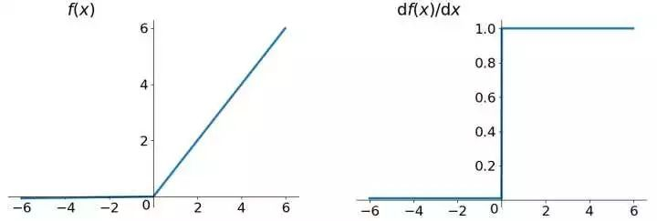

## 先去看书！先去看书！先去看书！
[Deeplearningbook中文版](https://github.com/exacity/deeplearningbook-chinese)
[github上的相关课程](https://github.com/ionvision/DeepLearningCourseCodes)

## 急功近利，先看U-Net
虽然讲说基础不牢地动山摇，但人生苦短。
反正我也是来做图像分割的，那先从图像分割倒序学习也没什么问题吧。

[遇事不决先看U-Net原文](https://arxiv.org/pdf/1505.04597v1.pdf)

### ReLU函数
激励函数
**激活函数是用来加入非线性因素的，因为线性模型的表达力不够。**
假设如果没有激活函数的出现，你每一层节点的输入都是上层输出的线性函数，很容易验证，无论你神经网络有多少层，输出都是输入的线性组合，与没有隐藏层效果相当，也就是说没有激活函数的每层都相当于矩阵相乘。就算你叠加了若干层之后，无非还是个矩阵相乘罢了。就是最原始的感知机（Perceptron），网络的逼近能力就相当有限。正因为上面的原因，我们决定引入非线性函数作为激活函数，这样深层神经网络表达能力就更加强大（不再是输入的线性组合，而是几乎可逼近任意函数）
二分类问题有无激活函数的差异：

神经网络的数学基础是处处可微的，选取的激活函数要能保证数据输入与输出也是可微的，运算特征是不断进行循环计算，所以在每代循环过程中，每个神经元的值也是在不断变化的。

ReLU函数

$$ f(x)=max(0,x)$$

**ReLU其实就是个取最大值的函数。**
ReLU函数其实是分段线性函数，把所有的负值都变为0，而正值不变，这种操作被成为单侧抑制。（也就是说：在输入是负值的情况下，它会输出0，那么神经元就不会被激活。这意味着同一时间只有部分神经元会被激活，从而使得网络很稀疏，进而对计算来说是非常有效率的。）正因为有了这单侧抑制，才使得神经网络中的神经元也具有了稀疏激活性。尤其体现在深度神经网络模型(如CNN)中，当模型增加N层之后，理论上ReLU神经元的激活率将降低2的N次方倍。

选用ReLU函数作为激活函数的好处有以下几个：

①没有饱和区，不存在梯度消失问题。

②没有复杂的指数运算，计算简单、效率提高。

③实际收敛速度较快，比 Sigmoid/tanh 等激活函数快很多。

④比 Sigmoid 更符合生物学神经激活机制。

当然relu也存在不足：就是训练的时候很”脆弱”，很容易就die了. 举个例子：一个非常大的梯度流过一个 ReLU 神经元，更新过参数之后，这个神经元再也不会对任何数据有激活现象了。如果这个情况发生了，那么这个神经元的梯度就永远都会是0.实际操作中，如果你的learning rate 很大，那么很有可能你网络中的40%的神经元都”dead”了。 当然，如果你设置了一个合适的较小的learning rate，这个问题发生的情况其实也不会太频繁。

**Leaky ReLU函数**

$$f(x)=max(0.01x,x)$$

可以回避一些ReLU的问题，具有ReLU所有有点，不会有Dead ReLU的问题。

**ELU (Exponential Linear Units) 函数**

$$ f(x)=\left \{
    \begin{array}{lr}
    x,&\text {if } x>0 \\
    \alpha(e^x-1),& \text {otherwise} \\
    \end{array}
    \right. $$

类似leaky ReLU, 但计算量稍大。

没事就用ReLU, ReLU不好用就换上面这俩，目前别的都不好用，计算量大。

### 图像的卷积和反卷积（上采样）

图像的卷积实际上是利用卷积核来对图像进行特征提取的一个过程。卷积核是一个矩阵，通过设计这个矩阵（如矩阵的大小、矩阵中的数值），就可以把相对应的图像特征提取出来，如图像的边缘特征、纹理特征等等。

从上图可以看到，原图经过卷积后，结果图像比原图小了一圈，这是因为卷积核本身也有大小，导致原图的边缘信息没法完全卷积到所造成的。为了避免这种现象，在对图像进行卷积时，一般会先对原图进行扩大（一般是在图像周围加一圈0），以保证在卷积后的图像大小和原始图像相同。

  

在5×5原图（蓝色）的外面扩大一圈（白色）后，通过3×3卷积核卷积的结果图（绿色）能够同样保持5×5大小。

那如果把原图再往外扩大几圈呢？

把2×2原图扩大了两圈，再通过3×3的卷积核，卷积结果图像被增大为4×4的大小。

由以上所有结果可见，卷积其实一共有3种情况：

①卷积后，结果图像比原图小：称之为valid卷积

②卷积后，结果图像与原图大小相同：称之为same卷积

③卷积后，结果图像比原图大：称之为full卷积

其中，full卷积其实就是反卷积的过程。到这里应该可以意识到，反卷积实际上也是一种特殊的卷积方式，它可以通过full卷积将原图扩大，增大原图的分辨率，所以对图像进行反卷积也称为对图像进行“上采样”。因此，也可以很直接地理解到，图像的卷积和反卷积并不是一个简单的变换、还原过程，也就是先把图片进行卷积，再用同样的卷积核进行反卷积，是不能还原成原图的，因为反卷积后只是单纯地对图片进行扩大处理，并不能还原成原图像。

蓝色是3×3的卷积核，在原图进行卷积和反卷积后，最后得到的图像跟原图是不一致的。因此，通过反卷积并不能还原卷积之前的矩阵，只能从大小上进行还原，因为反卷积的本质还是卷积。如果想要还原成原图像，只能通过专门设计不同的卷积核来实现。

**池化层（下采样）**

池化是一种减少参数的计算方法，而减少参数的方法就是直接把一些删除，池化层就是专门用于降低参数的处理层。池化一般分为最大池化和平均池化，我们更常用的是最大池化。

**损失函数**  
Loss Function是用来估量模型的预测值与真实值的不一致程度，它是一个非负实值函数，损失函数越小，模型的训练效果越好，鲁棒性越强。这是神经网络在通过梯度下降等方法调整参数，使得训练结果不断逼近真实值时必须使用到的一个函数。

其中：

(softmax函数)

加权w(x)的原因，和U-net原文献中的分割任务有关，使用U-net对其他图片进行分割时可以不用该权重。

U-Net的结构
长成U形。

从最左边开始，输入的是一张572×572×1的图片，然后经过64个3×3的卷积核进行卷积，再通过ReLU函数后得到64个570×570×1的特征通道。然后把这570×570×64的结果再经过64个3×3的卷积核进行卷积，同样通过ReLU函数后得到64个568×568×1的特征提取结果，这就是第一层的处理结果。

第一层的处理结果是568×568×64的特征图片，通过2×2的池化核，对图片下采样为原来大小的一半：284×284×64，然后通过128个卷积核进一步提取图片特征。后面的下采样过程也是以此类推，每一层都会经过两次卷积来提取图像特征；每下采样一层，都会把图片减小一半，卷积核数目增加一倍。最终下采样部分的结果是28×28×1024，也就是一共有1024个特征层，每一层的特征大小为28×28。

右边部分从下往上则是4次上采样过程。从最右下角开始，把28×28×1024的特征矩阵经过512个2×2的卷积核进行反卷积，把矩阵扩大为56×56×512（注意不是1024个卷积核，结果仅仅是右半边蓝色部分的512个特征通道，不包含左边白色的），由于反卷积只能扩大图片而不能还原图片，为了减少数据丢失，采取把左边降采样时的图片裁剪成相同大小后直接拼过来的方法增加特征层（这里才是左半边白色部分的512个特征通道），再进行卷积来提取特征。由于每一次valid卷积都会使得结果变小一圈，因此每次拼接之前都需要先把左边下采样过程中的图片进行裁剪。矩阵进行拼接后，整个新的特征矩阵就变成56×56×1024，然后经过512个卷积核，进行两次卷积后得到52×52×512的特征矩阵，再一次进行上采样，重复上述过程。每一层都会进行两次卷积来提取特征，每上采样一层，都会把图片扩大一倍，卷积核数目减少一半。最后上采样的结果是388×388×64，也就是一共有64个特征层，每一层的特征大小为388×388。

在最后一步中，选择了2个1×1的卷积核把64个特征通道变成2个，也就是最后的388×388×2，其实这里就是一个二分类的操作，把图片分成背景和目标两个类别。

**U-net的卷积核大小、卷积核数量、卷积核中的数值、训练深度怎么确定？**  
总而言之，玄学。

①U-net卷积核的大小为什么是3×3？

卷积核的大小可以自己定义，或者根据实验结果的优劣来进行选择。但一般的选择原则为卷积核越小越好，且一般为奇数×奇数的正方形。卷积核越小，能够大大地降低计算复杂性，但其中1×1的卷积核不具有提升感受野的作用，而卷积核为偶数×偶数时不能保证图片在进行same卷积操作后，还能够还原到原本的大小（会比原图多一条边/少一条边，自己画个图就明白了），因此通常选用3×3的卷积核。

②每一层的卷积核数量为什么是64→128→256→512→1024？

卷积核的数量也没有标准，也是自己设置或者根据实验结果的好坏进行选择。但是卷积核过少会导致特征提取得不充分，导致训练效果差，而卷积核过多则会大大加大计算量，会存在过多冗余信息。在U-net浅层中，提取的一般是颜色、轮廓等比较浅显的图像特征，因此卷积核数量不需要特别多，而随着U-net训练层数越深，提取的很多都是图片中无法命名的抽象特征，因此需要更多的卷积核才能够把这些特征提取出来。而U-net每一层都会把卷积核数量翻一倍，是因为经过下采样后图片大小会变成原来的一半，因此认为卷积核应该增多一倍才能够更全面地提取图片特征。

③卷积核中的数值如何确定？

前面提到过，卷积核中的数值实际上就相当于是一般全连接神经网络中的权值，在全连接神经网络中，权值的确定一般都是经过“初始化→根据训练结果逐步调整→训练精度达到目标后停止调整→确定权值”这样一个过程，因此U-net卷积核中数值的确定过程也是类似的，一开始也是先用随机数（服从高斯分布）进行初始化，后面则根据前面提到的损失函数逐步对数值进行调整，当训练精度符合要求后停止，即能确定每个卷积核中的数值。而调整卷积核数值的过程，实际上就是U-net的训练过程，当卷积核结束训练确定数值后，则U-net训练完成，下面将可以用测试集来测试网络的鲁棒性和对新的图片进行分割预测。

④U-net训练深度如何确定？

这跟全连接神经网络中“神经网络层数如何确定”这样一个问题是类似的，目前也没有一个专门的标准，一般根据经验选取，或设置多种不同的深度，通过训练效果来选择最优的层数。U-net原文中也没有提到为什么要选择4层，可能是在该训练项目中，4层的分割效果最好。

**UNet的创新点**
overlap-tile策略
在U-Net结构中,卷积全程都使用valid来进行卷积,该卷积的特点就是没有padding, 即padding = 0,所以特征图(feature map)会越卷越小,它不会越卷越大,导致了最后输出的尺寸回不到原来输入的尺寸

原本以为U-Net是一个绝对对称的结构, 然而并不是,它左右两边feature map的尺寸不一致,原因就是因为valid卷积,只会越卷越小.如下图的层A,如果这个卷积有padding,那么它可以回到32x32,然后再上采样2x2后,层B就变为64x64,依次轮推最终实现结构的绝对对称
显然，如果生生把原始图像喂进来，最后输出的结果，会比原始图像小好多。我们希望输入跟输出尺寸一样，即不能强行scale up最后的输出，又不想给每层卷积加padding
于是就诞生了重叠-切片(overlap-tile)策略, 该策略的思想是：对图像的某一块像素点（黄框内部分）进行预测时，需要该图像块周围的像素点提供上下文信息（context），以获得更准确的预测。简单地说, 就是在预处理中,对输入图像进行padding, 通过padding扩大输入图像的尺寸，使得最后输出的结果正好是原始图像的尺寸，同时, 输入图像块的边界也获得了上下文信息从而提高预测的精度。
在U-Net原文中，用的镜像操作(mirror padding)，实际上可以使用别的padding方法。
因此, 使用Overlap-tile策略对数据进行预处理是有必要的,可对任意大的图像进行无缝分割. 而这种方法通常需要将图像进行分块(patch)的时候才使用。

那么为什么要对图像分块(patch)再输入，而不是直接输入整张图像呢？因为内存限制，有的机器内存比较小，需要分块。然后再通过Overlap-tile 策略将分块图像进行预处理扩大输入尺寸。

**魔改U-Net**
1. 改损失函数
2. 改结构，如UNet++  
[围观UNet大佬](https://zhuanlan.zhihu.com/p/44958351)